# For Developers

This document is updated on 03/16, 2023.

## How to Edit the Map

Take the `Ship_Map` in **"Content/Maps/"** for example. This map contains no actors in the world but a `GameMode Override` and several sub-levels (in **"Content/Maps/SubLevels/"**). Open the "Levels" tab in "Window" tab to see the details of levels. 

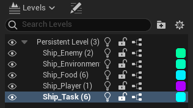

### 0. Create a Sub-Level

Currently all the sub-levels are in **"Content/Maps/SubLevels/"**. You can create an empty level there. Do not open it. 

Then, you can add this level into the level you have opened. The new level (as a sub-level) is attached to the opened level (as a persistent level). 

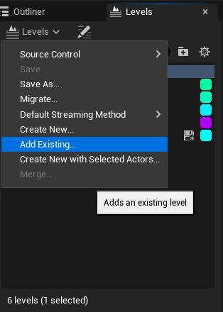

Last but not least, change the streaming method to be `Always Loaded`. **Otherwise, this sub-level will not be loaded unless you open this level explicitly! ** 

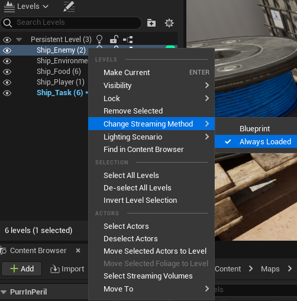

### 1. Edit the Sub-Level

The following example shows how to place a task actor into the `Ship_Map`. 

Double-click the `Ship_Task` to edit the task sub-level. After that, you may see a panel showing the current context. You can check whether you are editing the `Ship_Task`. 

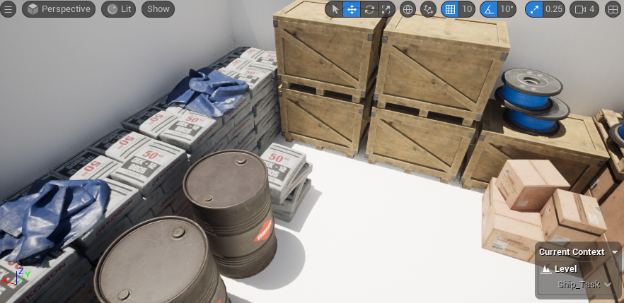

Then put the task into the viewport. Move it into the `Tasks` folder in the outliner. Sometimes there may be hints of actors out of bound of the level, but it does not matter. (Really?)

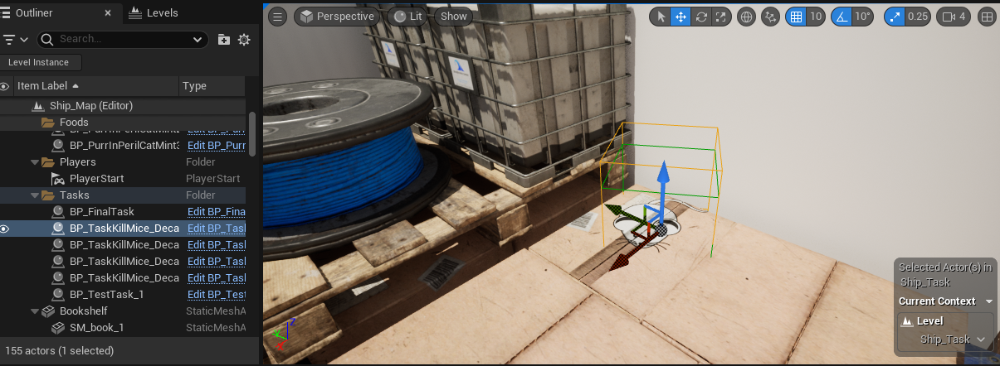

Double-check whether you are editing and only editing the `Ship_Task`.  If all done, save `Ship_Task`. **Saving the sub-level is enough. You had better not save the `Ship_Map`, though there is nothing in the "Ship_Map" itself so merging the conflict is easy.**

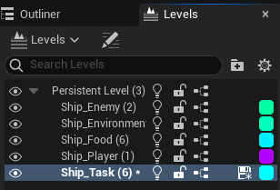

## How to Create A New Task

### 0. Check the Class

All the task actors are derived from `APurrInPerilTaskActorBase`. Task actors with widgets can be derived from `APurrInPerilWidgetTaskActor` which is directly derived from `APurrInPerilTaskActorBase`.  

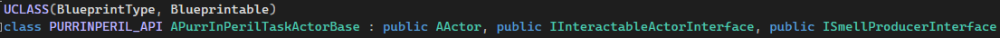

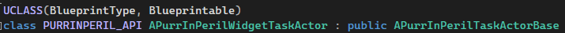

### 1. Create A Blueprint of Actor

You can create a blueprint in **"Content/Blueprints/Tasks/"** deriving from one of them, depending on whether you need interactions via widgets. 

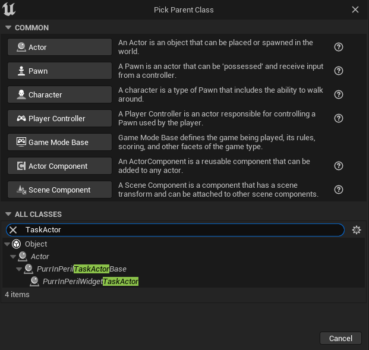

For each task actor, there are an interactable component as `UPurrInPerilInteractableComponent` (for interface of interaction and overlap detection) and a smell produce component as `UPurrInPerilSmellProduceComponent` (for smell system) attached to the root component. You can also attach components you need. In this example, a static mesh is attached. 

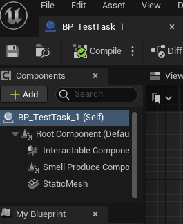

If you create a widget task actor, you should set the `Task Widget Class` of this actor, which is the class of widget that you want to show the task. 

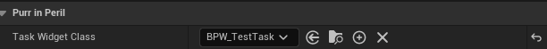

### 2. Create A Task Widget (for Widget Task Actor only)

You can create a widget blueprint in **"Content/Blueprints/Tasks/TaskWidgets"**. Your widget blueprint from `BPW_TaskContentWidgetBase`. This base class defines a task panel and keeps track of the interacted task actor as `Task Owner`. 

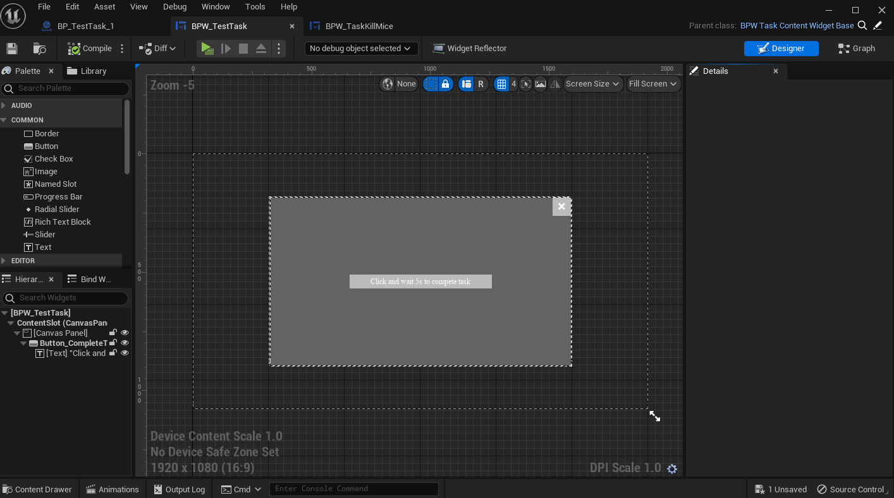

Once you created, you can set the `TaskWidgetClass` of the task actor.

### 3. Bind to A Task Identifier

Open the data asset `DA_TaskIdentifierMapping` in **"Content/Blueprints/Data/"** which is bound in the game instance (check in `BP_PurrInPerilGameInstance` in **"Content/Blueprints/Gameplay/"**). Add a pair of mapping. The key is the class of the task actor, and the value is the task identifier. Notice that it can be multiple task actors for a task identifier. Check **"PurrInPerilAsset.h"** for details. 

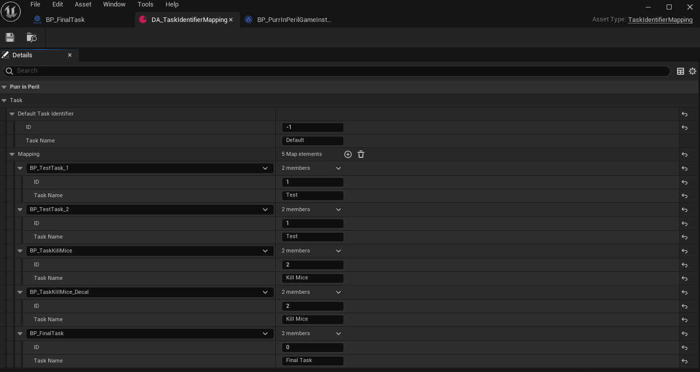

### 4. Check What You can Override

You can check what functions you can override in the task actor. 

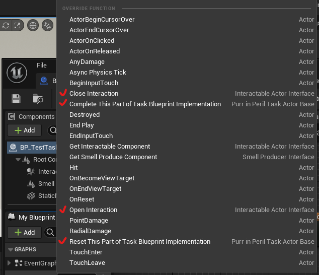

For interactions, you can override `Open Interaction` and `Close Interaction`. The `APurrInPerilWidgetTaskActor` has a default behavior of opening and closing the task widget for these functions. Check the cpp files for details. 

For the behaviors when the task is completed, you can override the `Complete This Part Of Task Blueprint Implementation` function. Noticing that a task identifier can be related to multiple task actors, which is why the functions are called `Complete This Part Of Task`. The `APurrInPerilTaskActorBase` has a default behavior of flagging the completion of the task of this actor, disabling the `bWithSmell`  of smell produce component (does not disable the `bInteractable` of interactable component since extra messages may be shown on the widget of a completed task), and broadcasting the message to the player controller. Check the cpp files for details. The reset function has not been used yet, so you can ignore it. 

### 5. Implement Your Rules of Task

Now, player completing a task is actually fulfilling your rules to call the `Complete This Part Of Task` function. 

Here is an example of a widget task. Check `BP_TestTask_1` and `BPW_TestTask` for details. 

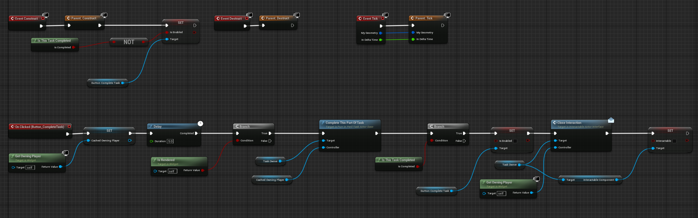

For a non-widget task actor, you should also define the behavior of interaction. Here is an example of directly completing the task once the player interacts with the task actor.

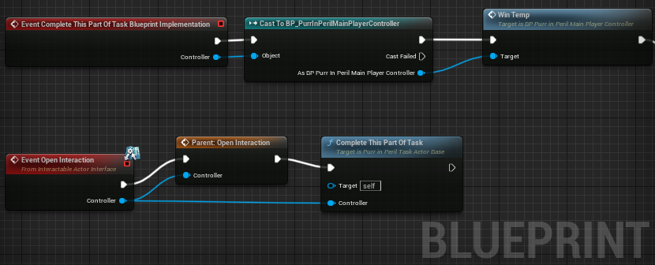

### 6. Put the Task Actor into the Level

See "How to Edit the Map".

Check all the details in contents and source files. 

